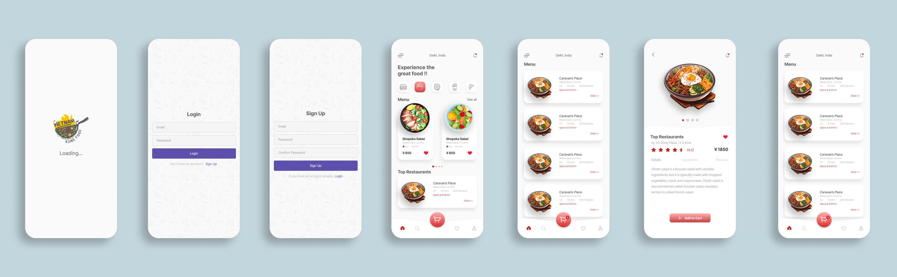

# FoodApp

## Mô tả
FoodApp là một ứng dụng di động giúp người dùng khám phá và thưởng thức các món ăn đa dạng từ khắp nơi trên thế giới. Ứng dụng cung cấp một danh sách các món ăn, công thức nấu ăn, và thông tin về các nhà hàng gần bạn. Với giao diện thân thiện và dễ sử dụng, FoodApp sẽ giúp bạn tìm kiếm và đặt món ăn một cách nhanh chóng và tiện lợi.

## Giao diện của Food App :


## Tính năng
- **Khám phá món ăn**: Duyệt qua các món ăn phổ biến và tìm kiếm theo loại ẩm thực.
- **Công thức nấu ăn**: Xem và lưu các công thức nấu ăn với hướng dẫn chi tiết.
- **Đánh giá và nhận xét**: Người dùng có thể đánh giá và để lại nhận xét cho các món ăn và nhà hàng.
- **Đặt hàng trực tuyến**: Đặt món ăn từ các nhà hàng gần bạn và theo dõi trạng thái đơn hàng.
- **Lưu trữ yêu thích**: Lưu lại các món ăn và nhà hàng yêu thích để truy cập nhanh hơn.

## Cài đặt
1. Clone repo:
   ```bash
   git clone https://github.com/username/foodapp.git
Cài đặt các package:
bash
Sao chép mã
npm install
Sử dụng
Đăng nhập hoặc đăng ký tài khoản để sử dụng tất cả các tính năng của ứng dụng.
Khám phá và tìm kiếm món ăn theo ý thích.
Đặt hàng và thưởng thức ẩm thực từ các nhà hàng yêu thích của bạn.
Công nghệ sử dụng
React Native: Framework để phát triển ứng dụng di động.
Firebase: Dịch vụ backend cho xác thực người dùng và lưu trữ dữ liệu.
Redux: Quản lý trạng thái ứng dụng.
Liên hệ
Nếu bạn có bất kỳ câu hỏi nào, vui lòng liên hệ với chúng tôi qua email: contact@foodapp.com

Tạo bởi
Vũ Doãn Dũng

### Hướng dẫn sử dụng
- Thay thế các giá trị như `username`, `Họ và tên của bạn`, và các chi tiết khác để phù hợp với ứng dụng của bạn.
- Bạn có thể thêm hoặc xóa các phần mô tả theo ý muốn để phù hợp hơn với nội dung và tính năng của ứng dụng.

